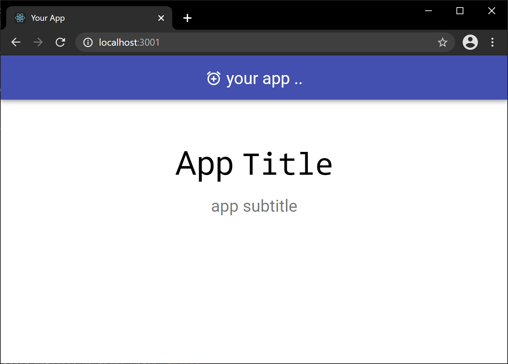

# template-typescript-mui-simple

This is a simple `material-ui` template app created using `create-react-app`'s `typescript` template. Looks like so ..



# Usage

1. Clone the repo
   ```sh
   git clone https://github.com/try-it-dev/template-typescript-mui-simple.git
   ```
1. Rename the repo to `client`

   Shell

   ```sh
   mv template-typescript-mui-simple client
   ```

   Windows bash

   ```bash
   rename template-typescript-mui-simple client
   ```

1. Install & run
   ```sh
   cd client
   npm install
   npm start
   ```

# How we built it

1. This is built using create-react-app like so ..

   ```sh
   npx create-react-app client --template typescript
   ```

1. Added additional packages

   ```sh
   npm install --save @material-ui/core
   npm install --save @material-ui/icons
   npm install --save @types/react-router-dom
   ```

1. Added **Index** page in `pages`

1. Added material ui theme under `themes`

1. Added the **Header** component

1. Modified the `App` to serve `IndexPage` on the default route
